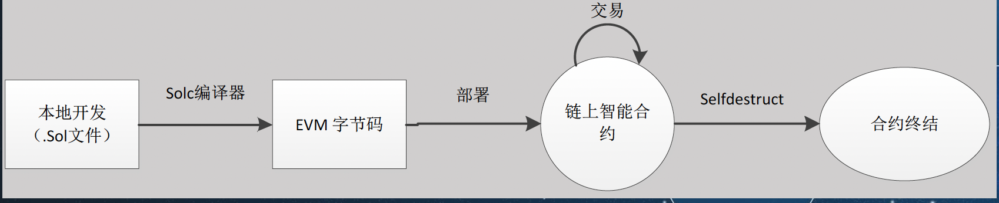
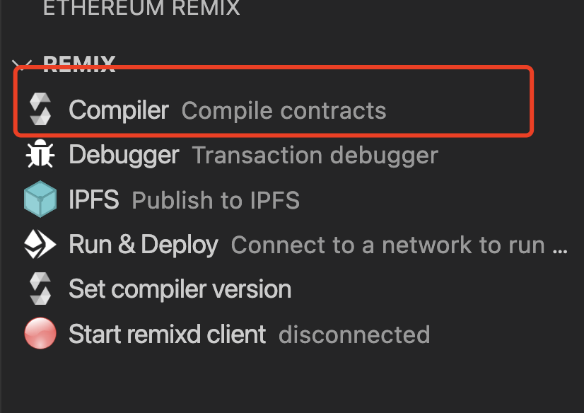
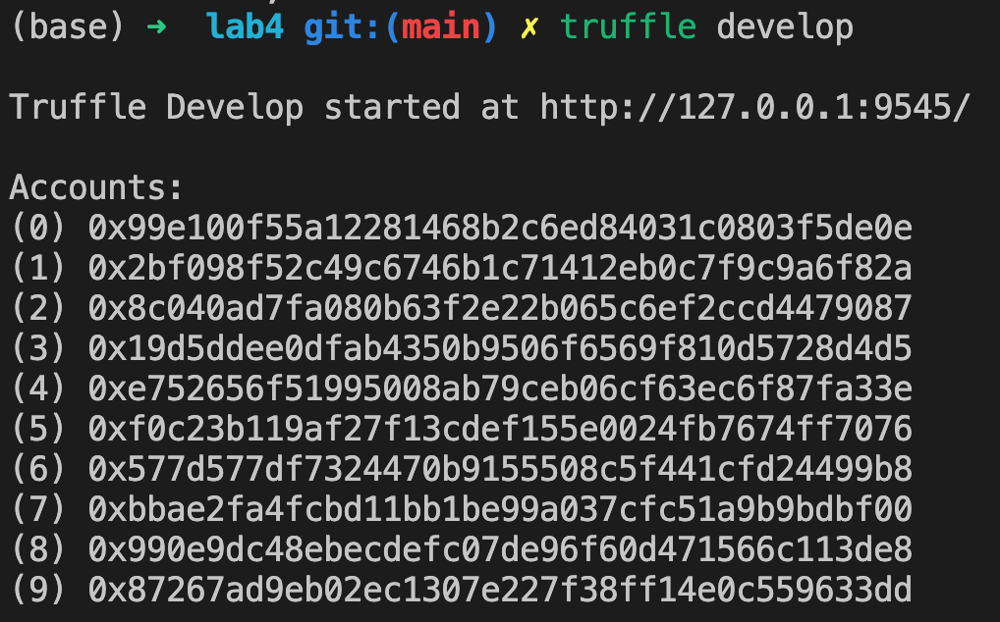
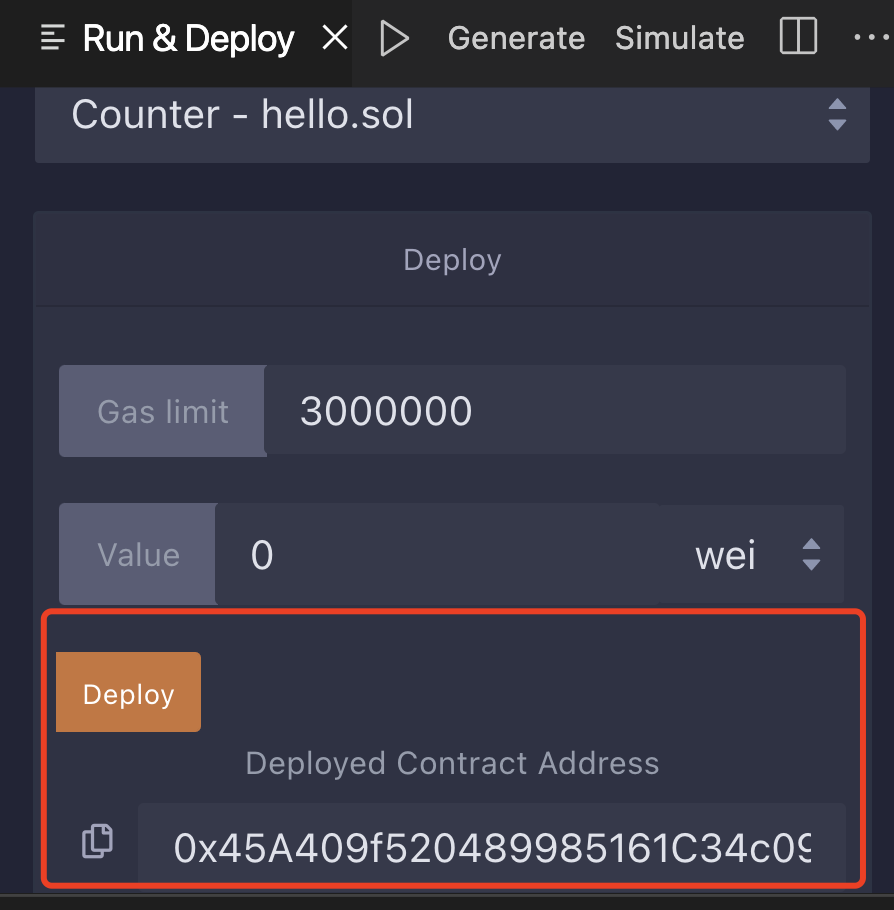
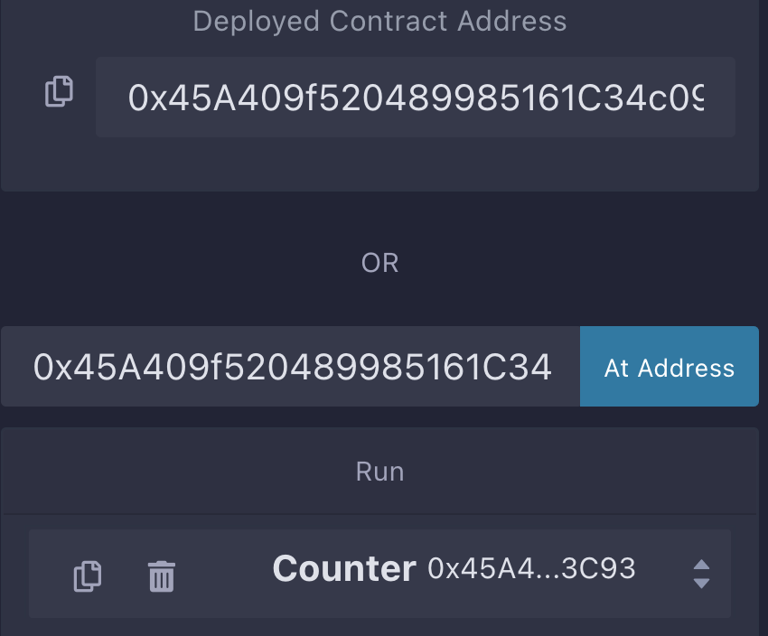

# 实验三 智能合约的开发和部署

## 实验目的

- 理解以太坊上智能合约
- 开发实现简单的智能合约
- 部署以太坊上的智能合约

## 实验介绍

### 智能合约

智能合约是一种特殊协议，在[区块链内制定合约时使用，当中内含了代码函数 (Function)，亦能与其他合约进行交互、做决策、存储资料及发送以太币等功能。智能合约主力提供验证及执行合约内所订立的条件。智能合约允许在没有第三方的情况下进行可信交易。这些交易可追踪且不可逆转。智能合约概念于1994年由一名身兼计算机科学家及密码学专家的学者尼克·萨博首次提出。

### 以太坊上的智能合约

在以太坊上，智能合约是一个运行在以太坊链上的程序。 它是位于以太坊区块链上一个特定地址的一系列代码（函数）和数据（状态）。

智能合约也是一个以太坊帐户，我们称之为合约帐户。 这意味着它们有余额，可以成为交易的对象。 但是，它们无法被人操控，它们是被部署在网络上作为程序运行着。 个人用户可以通过提交交易执行智能合约的某一个函数来与智能合约进行交互。 智能合约能像常规合约一样定义规则，并通过代码自动强制执行。 默认情况下，您无法删除智能合约，与它们的交互是不可逆的.

以太坊上的智能合约基本生命周期可以分为开发、编译、部署和运行。在开发阶段，开发程序员可以利用各种各样的编辑器，CLI，编译器，将solidity源文件编译成EVM字节代码。可以在本地或者测试网里测试。在运行阶段，智能合约一经部署，就一直运行。直到合约所有者去自我摧毁智能合约



### 合约的编译和部署

在本次试验中，我们使用[Truffle](https://trufflesuite.com/docs/truffle/) 集成开发环境可以开发、部署和管理类似区块链的以太坊智能合约。

truffle的项目对应文件目录如下：

```
├── build //对应合约编译生成的内容
│   └── contracts
├── contracts //合约的位置
│   └── hello.sol 
├── migrations //对应deploy执行的部分
│   └── 1_deploy_contracts.js
```


以hello.sol为例，对应文件内容为

```
// SPDX-License-Identifier: MIT
pragma solidity >=0.5.17;

contract Counter {

    // Public variable of type unsigned int to keep the number of counts
    uint256 public count = 0;

    // Function that increments our counter
    function increment() public {
        count += 1;
    }

    // Not necessary getter to get the count value
    function getCount() public view returns (uint256) {
        return count;
    }
}
```

通过compile来编译对应文件

```
truffle compile
```



启动本地测试链

```
truffle develop
```



部署合约

```
truffle migrate
//在console中只需要输入migrate
```



合约调用

```
let instance = await Counter.deployed() //查询部署的合约
instance.getCounter() //调用getCounter方法
instance.increment() //调用increment方法
```



## 实验内容

- 实现一个简单的投票合约
- 部署和调用合约

## 参考资料

[Solidity编写](https://docs.soliditylang.org/zh/v0.8.17/introduction-to-smart-contracts.html)

[truffle](https://trufflesuite.com/docs/truffle/quickstart/)